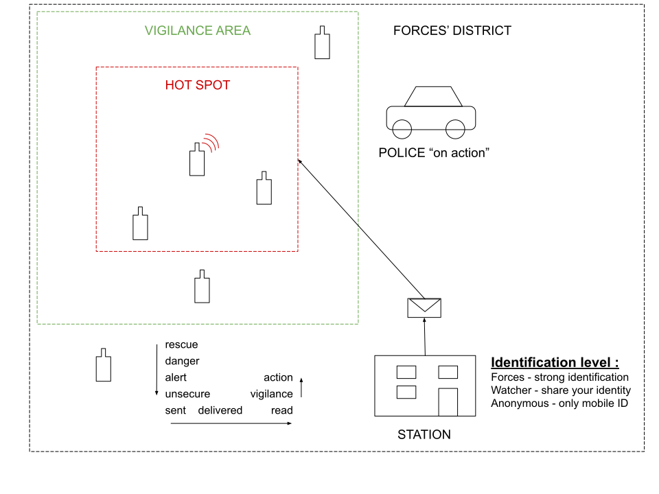
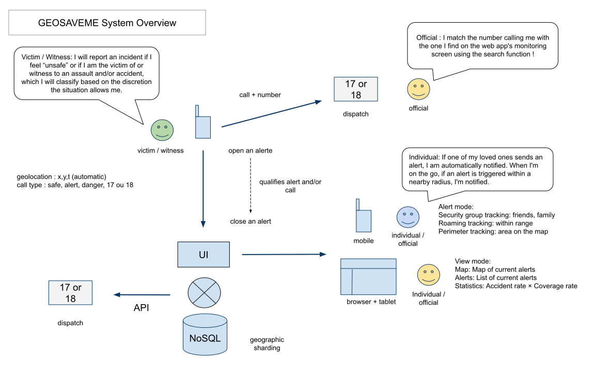
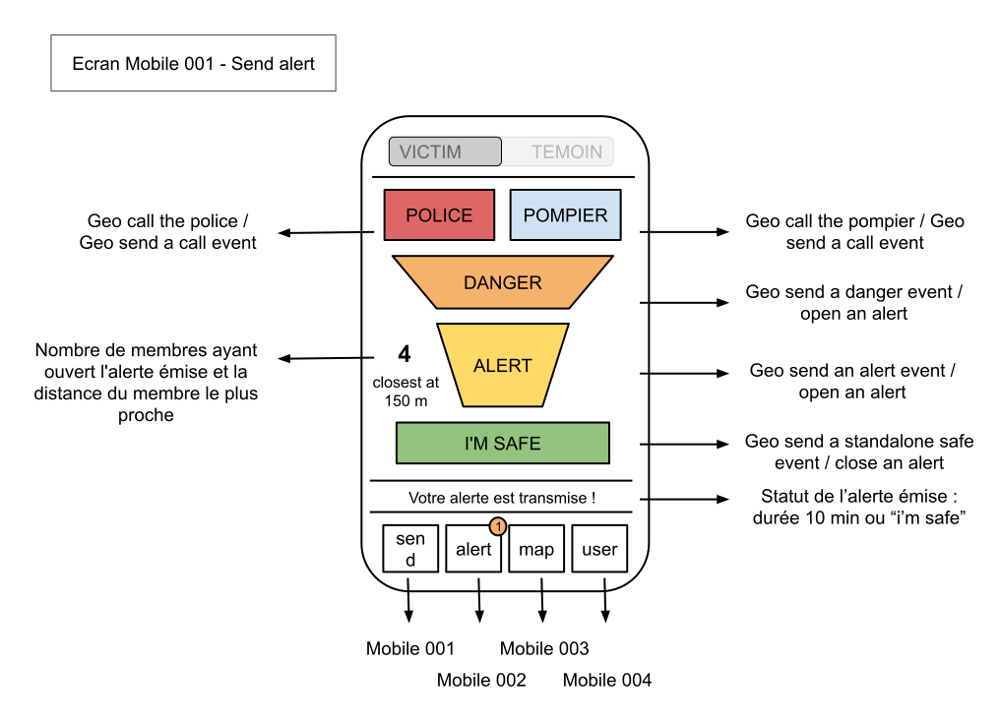
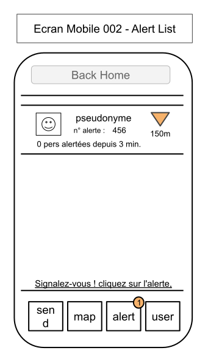
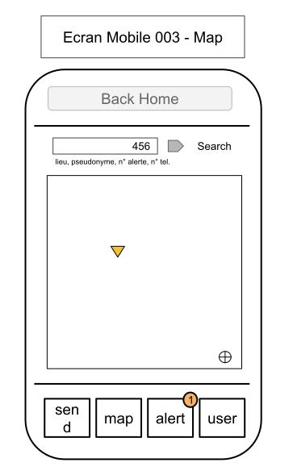
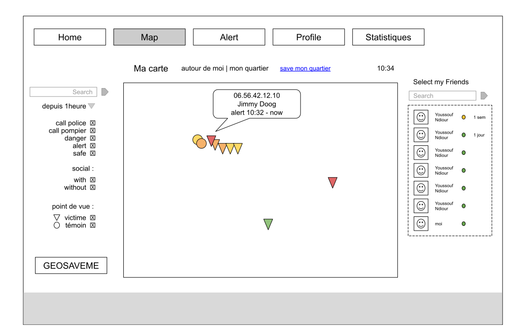

# SAVE ME — Functional Specifications

> **Version** 2.0 — Merged & expanded (Alert Dimensions · Broadcasting & Statistics · Use Cases Taxonomy)  
> **Original** JB.Gosset (FR) · **Translated & expanded** for EN-first strategy  
> **i18n note** All user-facing strings are keyed. See `i18n/` directory for locale files.

---

## Table of Contents

1. [Context & Vision](#1-context--vision)
2. [User Types](#2-user-types)
3. [Use Cases](#3-use-cases)
4. [Data Model](#4-data-model)
5. [Broadcasting & Perimeter](#5-broadcasting--perimeter)
6. [Screens & Flows](#6-screens--flows)
7. [Statistics & Reporting](#7-statistics--reporting)
8. [i18n Architecture](#8-i18n-architecture)
9. [Open Questions](#9-open-questions)
10. [Appendix — Emergency Services Reference](#10-appendix--emergency-services-reference)

---

## 1. Context & Vision

### Problem Statement

A significant gap exists between minor security incidents and formal emergency calls. Many events — harassment, threatening behavior, accidents without casualties — go unreported because the available tools are binary: either do nothing or call emergency services.

SAVE ME fills this gap by providing a **geolocated civilian alert network** that connects:
- People in danger or witnessing an incident
- Nearby civilians who can assist or avoid the area
- Patrol officers who can respond preemptively
- Surveillance centers that can correlate incoming alerts with dispatch calls

### Core Values

#### Safety
The safety of individuals is the primary objective of the application. Any mechanism that compromises this objective must be corrected or removed.

#### Neutrality
The platform must not favour any preconceived notion of aggressors or users. This is reinforced by the anonymity principle.

#### Anonymity
Users are anonymous — only their devices are identified. The identity of first responders and security forces is known to the platform but is never shared publicly. When an emergency call is placed, standard identification mechanisms take over without any link to the platform.

### General Principles

SAVE ME is built around four foundational principles:

**Coordination of emergency response** — Facilitate the coordination of emergency services and alert successive solidarity circles (family, friends, nearby individuals, professionals…).

**Alert reliability** — Strengthen the reliability of alerts through cross-referencing information made available by the platform.

**Benevolent social cohesion** — Reinforce positive social cohesion and the means available to responsible citizens.

**Protection from escalation** — Protect all actors involved from the risk of counter-aggression.

### Alerting Core Principle and Lifecycle

The app operates on **real-time local proximity**. Alerts are never broadcast globally — they are distributed only to users within the relevant geographic perimeter. This prevents media amplification and keeps the system operationally focused.

1. A victim or witness opens an alert (danger / police / fire / vigilance)
2. A **hotspot** is created at their location
3. Nearby users receive a push notification and can choose to respond
4. Officials in the district see the hotspot on their map
5. The alert remains open until the emitter closes it (e.g. on arrival of responders)
6. The frequency of "unsecure" button presses is logged to estimate stress level

### Design Constraints

- **Anonymous by default** — public users have no account, no password, no personal profile
- **No social media sharing** — prevents viral amplification and mob behavior
- **Local only** — alerts are geographically scoped
- **Neutral** — the app qualifies situations and their level of danger, never individuals
- **Credibility scoring** — a reputation system moderates alert quality without being punitive


*Figure 1 — Functional Overview: alert lifecycle, actor roles, and solidarity circles*

---

## 2. User Types

### 2.1 Victim or Witness

A person who feels in danger, is the victim of an aggression, or witnesses an accident. They open the app and emit an alert.

**Key behaviors:**
- Emits an alert with type selection (safe / vigilance / danger / call to forces / call to fire)
- Optionally adds context if the situation allows
- Keeps the alert open until resolved
- Can notify friends & family via the app if part of their security group
- Stress is estimated from button press frequency

**Privacy:** fully anonymous. No account required. Identified only by a hashed device ID.

### 2.2 Official (Patrol / Surveillance)

A verified professional from a security or emergency service (police, gendarmerie, fire brigade, SAMU, Red Cross, certified first responder).

**Key behaviors:**
- Authenticated via a verified organizational account
- Receives real-time alerts within their assigned district
- Can see alert details including the emitter's phone number (for emergency call correlation)
- Can qualify a hotspot once on scene
- Can broadcast targeted messages to a hotspot area
- Can operate in **stealth mode** (hidden from public map) to avoid alerting aggressors
- Can emit **ghost alerts** visible only to forces

**Privacy:** not anonymous — accountable to their organization.

### 2.3 Security Group : Friend or Family Member

A person who has been granted access by a victim or witness to their security group enabling reception of their alerts.

**Key behaviors:**
- Receives push notification via the app
- Sees basic alert status (type, rough location, open/closed)
- Cannot interact with the hotspot directly

**Privacy:** depends on what the emitter chooses to share.

### 2.4 Private Individual (Bystander)

A member of the public who is geographically near an active hotspot.

**Key behaviors:**
- Receives a push notification when a nearby hotspot opens
- Free to act: flee, stay neutral, offer presence, assist, or call for help
- If they engage, they become a **follower** of the hotspot and share their approximate position
- Their count is displayed to the victim (e.g. "4 watchers nearby") as reassurance

**Privacy:** position shared only approximately, not precisely, to protect their identity.

### 2.5 User Trust Levels

User trust levels reflect identity verification and accountability. They are distinct from credibility scores (see §4.6).

| Title | Description |
|---|---|
| **Anonymous** | Default status for all users. No identity disclosed. |
| **Non-anonymous** | Has agreed to share their identity, strengthening trust and credibility. |
| **First responder** | Validated via membership of a recognised association (Red Cross, VISOV, physician…). Not anonymous. |
| **Security professional** | Accredited by a public or private security body (Police, Gendarmerie, Fire service, SAMU…). |

---

## 3. Use Cases

### 3.1 Victim

The user is the victim of an event that is already or could become dangerous, he looks for support. He opens the app and tap the alert button. The hotspot is created at his GPS position is broadcasted to nearby members of the network. Officials see the pin on the map. If a call comes in matching the number, the dispatcher clicks the pin to see the full context. What could trigger the use of this app on the victim's perspective :
* Just feeling unsecure wanting to check local presence
* Being insulted on racial, sexual, religious or any purposes
* Being touched inapropriately with a sexual context
* Being injured due to roadside accident
* Having a medial emergency
* Aggressed or assaulted, with or without weapon
* Fire situation
* Others

Option : To monitor the feeling of emergency the victim can tap rapidly on the screen, which frequency is logged as a stress indicator.

Option : At hotspot opening the sound could start being recorded, and only shared with officials.

Depending on the situation victims may not be able to add context. This is where the witness can participate.

### 3.2 Witness

The user is witnessing an event. If this event has already been reported on the platform he can confirm his presence on the hotspot and add context if able to share specifics of the situation (number of people, injuries, presence of a weapon...). Nearby users are notified that the hotspot has been witnessed.
If the hotspot did not exit prior to the event then his alert emission combined with the witness status creates a new hotspot which is broadcasted. 
Exemple given, the user sees an assault in progress. He emits an alert discreetly. Nearby bystanders are warned. Police patrols of the sector concerned receive the hotspot. The user can add context if safe to do so.


### 3.3 Victim / Witness's Security Goup

The emitter opts to notify their circle. The friend receives a push (if they have the app) or a link. They see the alert status in real time and know help is on the way.
To be part of a user's security group he must have scanned the geosaveme QR code of the user the alert will be broadcasted to.
This could be a parent, a friend, a lover, any trustworthy person deemed to be alerted. 

### 3.4 Officials

#### on Patrol

The officer receives the hotspot notification on their mobile. They see the type of alert, the number of civilian followers, and the emitter's phone number if authorized via authentification and subscription. They navigate to the scene. Once on site, they can qualify the hotspot and broadcast a localized message.

#### in a Surveillance Center

The dispatcher sees a pin appear on their district map when an alert is emitted. A call comes in simultaneously. They match the phone number on the call to the pin and click it to see all context: alert type, stress level, qualifications, followers count. This replaces the blind "caller says they're somewhere on Rue de Rivoli" problem.

### 3.5 Private Individual

#### Walking Nearby

The user receives a notification: "Alert opened 200m from your location." They choose their response. If they engage, they appear as a watcher dot on the map (position approximate). Their presence count is shown to the victim.

#### at Home

The user receives a neighborhood digest (freemium: next-day summary) or a real-time push if a hotspot opens very close to their home. They can check the map to understand what is happening.

---

## 4. Data Model

### 4.1 Alert Types (UI Triggers)

These are the primary action buttons presented to the user when opening an alert.

| Key | Label (EN) | Severity | Description |
|-----|-----------|----------|-------------|
| `secure` | Secure | 0 | Normal mode or back to safe place and mood |
| `alert` | Alert | 1 | Low-level concern, potential risk, incivility, no physical interaction |
| `danger` | Danger | 2 | Explicit request for intervention, danger confirmed |
| `police` | Police Call | 3 | Requires law enforcement response |
| `fire` | Rescue Call| 3 | Requires fire brigade or SAMU response |

### 4.3 Alert Qualification

Qualification is an **asynchronous process**. The alert is emitted immediately upon button press; contextual details are transmitted progressively as the user fills them in.

#### 4.3.1 Qualification Dimensions

| Dimension | Options / Examples |
|---|---|
| **Severity** | At alert level (1): insecurity (perceived), incivility. At danger(2) or call level (3): assault, theft, rape, accident. |
| **Target** | Person or object (building, vehicle…), if personn verbal (no contact) or physical (with contact)|
| **Fact** | Insult, roamer, noise nuisance, exhibitionism, sexual touching, pickpocketing, burglary… |
| **Perception** | Flags a sexual, racial, religious or homophobic dimension to the incident. |
| **Aggravating factors** | With threats, intoxicated or drugged individual, in a group, presence of a weapon, presence of injured persons. |
| **Public mission** | Post-qualification category: security, public order, or sanitation in public space. |

#### 4.3.4 Other / Special Cases

- **Demonstrations** — Mass events present specific alert dynamics; dedicated qualification to be defined.
- **Pre-planned safety** — A user wishes to alert their friends at a given date and time.
- **Safe escort** — "Guardian angel" scheme or courteous accompaniment for users walking home.
- **Post event** — An alert or danger is reported post event for statistical purpose.
- **Registering a tracker** - And being alerted when the tracker enters a hotspot

### 4.4 Alert Modes

| Mode | Description |
|---|---|
| **Ghost** | The user does not want the alert broadcast locally to avoid counter-aggression. The alert is sent only to security professionals. |
| **Stealth** *(pro only)* | The security professional does not wish to be shown on the map near the intervention area, to prevent the aggressor from modifying their behaviour. |
| **Private** | Alerts and hotspots are only broadcasted to Security Groups |
| **Remote / Delayed** | Activating the alert does not immediately create a hotspot. Location is incorporated into the alert qualification after the fact. |

### 4.5 Issuer Position

| Position | Notes |
|---|---|
| **Victim** | Personal target of the aggression. Must be explicitly activated by the user. |
| **Witness** *(default)* | The preferred position for qualifying the situation and assisting emergency responders. |

### 4.6 User Credibility

Credibility scores are transmitted to security forces only, to help them assess the priority and relevance of their response. They are not permanent and evolve over time.

| Score | Profile |
|---|---|
| **Pro** | All certified first responders and official security professionals. |
| **2** | Has sent alerts corroborated by simultaneous alerts from others, with the hotspot confirmed by security services. |
| **1** *(default)* | Any user who has not yet had occasion to interact with the application. |
| **0.5** | Statistically excessive alert submissions not corroborated by simultaneous alerts from others. |
| **0** | Issuer of an alert on a hotspot subsequently qualified as a false alarm by security forces. |

Low-credibility alerts may be filtered by the network to avoid saturation. This filtering is opt-in for receiving users.

### 4.7 Miscellaneous Rules

- An alert can always be requalified or supplemented after the fact by its issuer, to accommodate the constraints of the lived situation — notably stress.
- The exact location of an alert is not shared with regular users, only with first responders and professionals, to minimise identification of the alert issuer and reduce the risk of counter-aggression.
- User credibility is transmitted to security forces only, to help them judge the opportunity and priority of their interventions.
- If a phone is reported stolen, it can be deactivated using its IMEI number.

### 4.8 Geolocation

**Cold location** (background, inactive users)
- Approximate accuracy (network-level)
- Triggered permanently to be selected for hotspot broadcast based on location
- Updated: location is sent only if move is detected, once moving location is updated every 10 minutes
- Purpose: identify users near a new hotspot to be able to notify them
- Permission : must be given by the user to receive hotspots creation, if not given the user can stil emit alerts

**Hot location** (foreground, active users / followers)
- High accuracy (GPS)
- Triggered only when arlerting, following a hotspot or entering a vigilance areay. It is also used for patrol and officials.
- Updated: every 30 seconds for helpers, every 10 seconds for officials
- Purpose: real-time tracking within an active hotspot
- Permission : is given at application first configuration for later alert triggering

**Position payload**
```json
{
  "mobileID": "hash(deviceID)",
  "hotspotID": "hash(deviceID+timestamp)",
  "source": "base | alert | follower | patrol",
  "position": {
    "type": "cold | hot",
    "lat": 48.8566,
    "lng": 2.3522,
    "accuracy": 12.5,
    "timestamp": "2024-03-01T14:32:00Z",
    "provider" : "GPS_PROVIDER | NETWORK_PROVIDER | PASSIVE_PROVIDER"
  },
  "cinetic": "still | onslowmove | onfastmove",
  "transportation": "walk | bike | car | train"
}
```


*Figure 2 — System Overview: services, data flows, and geolocation architecture*

---

## 5. Broadcasting & Perimeter

### 5.1 Groups

- There are 3 levels of membership in a group : owner which is unique, administrator and member
- Any user can create a group, name it, and share administrators rights with another member, ownership can be transmitted once as unique
- Group's membership is given by scanning the group's QR code and being validated by the administrator
- For group's membership, users choose a pseudonym associated to their account by which they are identified by other members
- The group administrator chooses the broadcast mode: alerts sent only to administrators (family, school trips…) or to all members (friends, adult leisure groups…)
- Alerts are broadcasted according to the group's chosen mode — to all members or to administrators only
- Group's administrators receive the accurate location of alerts like officials with public hotspots


### 5.2 Hotspot

- A hotspot is created every time an alert is triggered if the user is not already associated with an active hotspot. It defines a precise geographical perimeter, collects all subsequent alerts raised within that perimeter, and is broadcast to users present in the area at the time of the alert.
- Upon arriving at a hotspot, an agent validates the reality and relevance of the situation, increasing the hotspot's credibility and its followers.
- A hotspot generates a collaborative communication thread shared exclusively with professionals and first responders.

### 5.3 Vigilance Zone

The vigilance zone is a slightly wider perimeter around the hotspot. It anticipates the movement of users through the hotspot and triggers more frequent location updates for those within it.

### 5.4 Sector

Defines a geographical area within which an official security agent receives all alerts, can broadcast messages, and qualify hotspots.

---

## 6. Screens & Flows

### 6.1 Cinematics / Onboarding

- App open → permission requests (location background, notifications)
- Anonymous ID generated from device hash
- Role selection not required at onboarding — determined by context

### 6.2 Profile

- Public users: no profile screen (anonymous)
- Friends/Family: notification preferences, linked contacts
- Officials: login screen → account dashboard → district / subscription info

### 6.3 Alert Emission (Mobile)

**Primary screen — Victim or Witness view**

Components:
- Role toggle: `Victim` / `Witness`
- Status band: connection status + elapsed time since alert opened
- Severity scale: Vigilance → Danger
- Alert type grid: Police / Fire / Alert / Danger / Safe (closes alert)
- Context bar: optional text/voice input
- Stress meter: derived from button press frequency
- Responder stats: watcher count, average distance, official count
- Map preview: hotspot radius, moving responder dots, GPS accuracy

**Interactions:**
- Hold "Danger" for 2s to confirm (prevents accidental triggers)
- Tap "Safe" to close the alert
- Share button → notify friends via app push or social link


*Figure 3 — Mobile Screen 001 : basic sending alerts*

### 6.4 Alert Reception (Mobile)

**Bystander / follower view**

Components:
- Notification card: alert type, distance, time elapsed
- Response options: Flee / Neutral / Watch / Assist / Call
- Map showing hotspot (emitter position approximate)
- Watcher count for the hotspot

| Alert notification | Hotspot map |
|---|---|
|||
|*Figure 4 — Mobile Screen 002 : alert reception*|*Figure 5 — Mobile Screen 003 : perimeter surveillance (mobile)*|

### 6.5 Perimeter Surveillance (Web / Official)

- Full district map
- Hotspot pins with icon type  and severity color
- Click pin → alert details, emitter phone number (subscription), follower list
- Phone number matching: incoming call number highlights the matching pin
- Broadcast message to follower of a hotspot area for security guidance



*Figure 6 — Screen 001 : perimeter surveillance (surveillance center)*

### 6.6 History

- Chronological list of past alerts in a given area
- Per-alert detail: type, duration, follower count, official response time
- Available to freemium users (T+1 day), real-time for officials

---

## 7. Statistics & Reporting

### 7.1 Perimeter Statistics (Live / Official)

- Heatmap of alert density by area and time period
- Filterable by alert type, event type, time range
- Export for institutional reporting

### 7.2 Statistics Tiers (Civic & Institutional)

| Product | Scope | Description |
|---|---|---|
| **J+1 (Daily)** | Municipality | List of hotspots by day and category, with access to approximate hotspot location. |
| **M+1 (Monthly)** | Municipality | Heatmap of alerts by category over a one-month period. |
| **A+1 (Annual)** | Department | Heatmap of alerts by category over a one-year period. |

---

## 8. i18n Architecture

### Philosophy

The app is built **English-first**. All user-facing strings are externalized into locale files. The UI language is determined at runtime from device locale, with a manual override in settings.

### Directory Structure

```
i18n/
├── en.json          ← source of truth
├── fr.json          ← French (initial secondary locale)
├── es.json          ← Spanish (planned)
├── pt.json          ← Portuguese / Brazil (planned)
├── ar.json          ← Arabic (planned, RTL support required)
└── index.ts         ← locale loader + t() helper
```

### Key Naming Convention

```
{screen}.{component}.{element}
```

Examples:
```json
"alert.type.police":       "Police",
"alert.type.fire":         "Fire & Rescue",
"alert.type.danger":       "Danger",
"alert.type.vigilance":    "Vigilance",
"alert.type.safe":         "I'm Safe",
"alert.status.transmitted": "Alert transmitted · Secure link established",
"alert.stress.label":      "Estimated stress",
"alert.context.placeholder": "Add context",
"alert.context.hint":      "Optional · if situation allows",
"alert.responders.watchers": "Nearby watchers",
"alert.responders.distance": "Metres (avg.)",
"alert.responders.officials": "Officials",
"alert.map.gps":           "GPS · High accuracy",
"nav.alert":               "Alert",
"nav.map":                 "Map",
"nav.history":             "History",
"nav.profile":             "Profile",
"role.victim":             "Victim",
"role.witness":            "Witness",
"severity.low":            "Alert",
"severity.high":           "Danger",
"network.active":          "Network active"
```

### Runtime Usage (React Native / Web)

```typescript
// i18n/index.ts
import en from './en.json';
import fr from './fr.json';

const locales: Record<string, typeof en> = { en, fr };

export function t(key: string, locale: string = 'en'): string {
  const dict = locales[locale] ?? locales['en'];
  return key.split('.').reduce((o: any, k) => o?.[k], dict) ?? key;
}
```

```tsx
// Usage in component
import { t } from '@/i18n';
const locale = useLocale(); // 'en' | 'fr' | 'es' ...

<Text>{t('alert.type.police', locale)}</Text>
```

### RTL Support

Arabic and Hebrew locales require RTL layout. Add to root component:

```typescript
import { I18nManager } from 'react-native';
const RTL_LOCALES = ['ar', 'he'];
if (RTL_LOCALES.includes(locale)) {
  I18nManager.forceRTL(true);
}
```

### Market Pivot Checklist

When entering a new market, the following need locale-specific review beyond string translation:

- [ ] Emergency number (`911`, `999`, `112`, `17`, `18`…) — never hardcoded, always from config
- [ ] Official role labels (Police / Gendarmerie / Carabinieri…)
- [ ] Legal disclaimer text
- [ ] Privacy policy
- [ ] Date/time format
- [ ] Units (metric vs imperial for distance display)

```typescript
// config/market.ts
export const MARKET_CONFIG = {
  emergencyNumber: process.env.EMERGENCY_NUMBER ?? '112',
  distanceUnit: process.env.DISTANCE_UNIT ?? 'metric',   // 'metric' | 'imperial'
  officialLabel: process.env.OFFICIAL_LABEL ?? 'Police',
};
```

---

## 9. Open Questions

1. **Mandatory qualification for Vigilance and Alert levels?** → Proposed resolution: qualification is always offered; information is collected progressively with an incentive to complete the process as far as the situation allows.

2. **What does the "non-anonymous" user title add?** Is it necessary? Risk of undermining the value of anonymous status?

3. **User charter** — Should a usage charter be required and signed before a user can access the application?

4. **Media attachments** — Should it be possible to attach photos or audio recordings? If so, should these be shared only with security forces?

5. **Post-event (cold) alerts** — What is the value of recording post-event alerts? Main use case: aggregate statistics on incivilities on a declarative basis. Limited value but potentially a reliable and regular source of data. Also enables the broadcast of prevention messages.

6. **Gender of the individual** — Should the gender of the person involved be recorded, notably for sexual assaults? Current assessment: limited benefit and opens the door to further profiling of users.

---

## 10. Appendix — Emergency Services Reference

### France

| Service | Number | Dispatch Centre |
|---|---|---|
| Police | 17 | CIC — Centre d'Information et de Commandement (per département) |
| Gendarmerie | 17 | CORG — Centre Opérationnel de Renseignement Gendarmerie (per département) |
| Fire service | 112 | — |
| SAMU | 15 | — |
| SNCF / RATP transport | 3617 | — |

*Note: France has 13 emergency numbers in total. Emergency numbers are never hardcoded in the app — see `config/market.ts`.*
